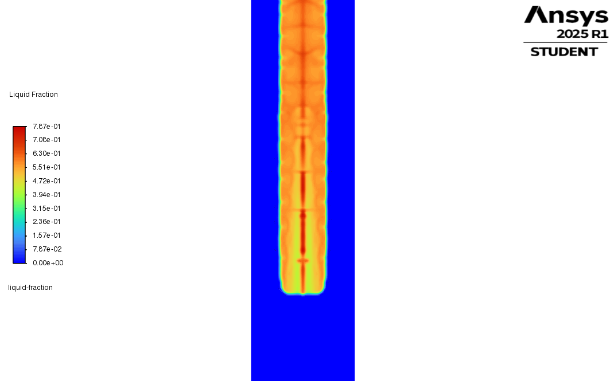
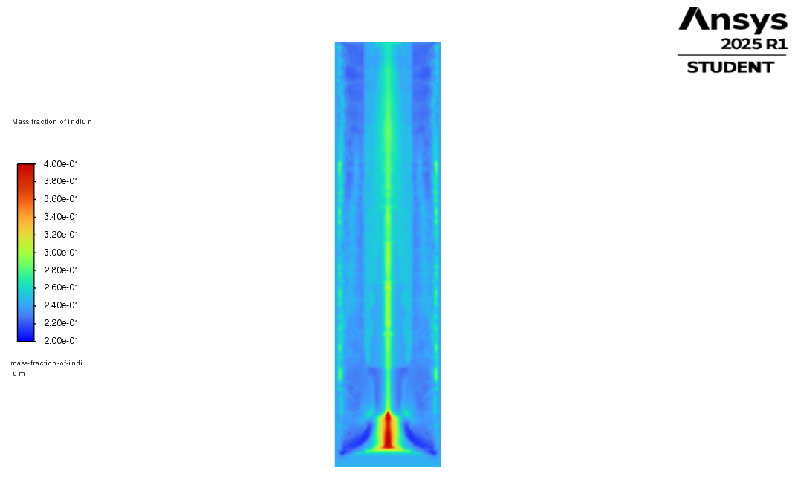
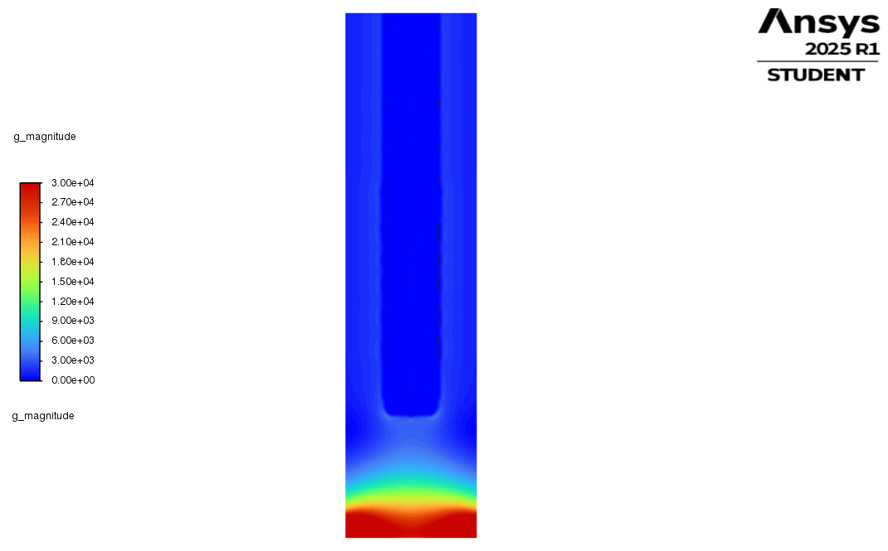
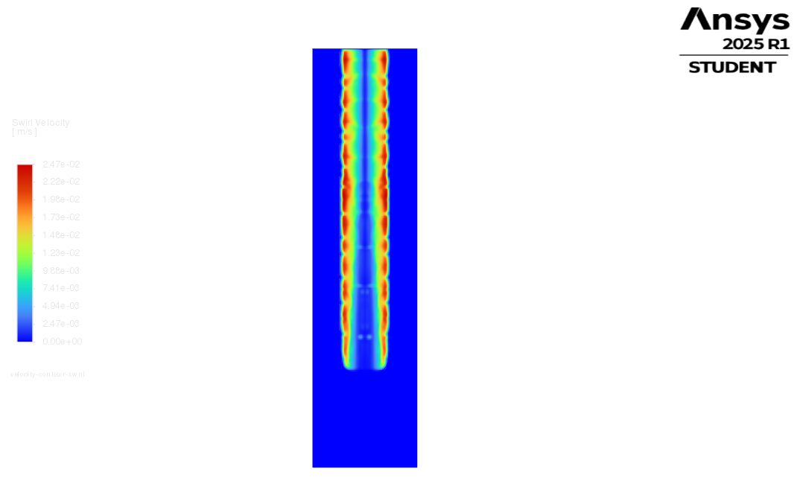
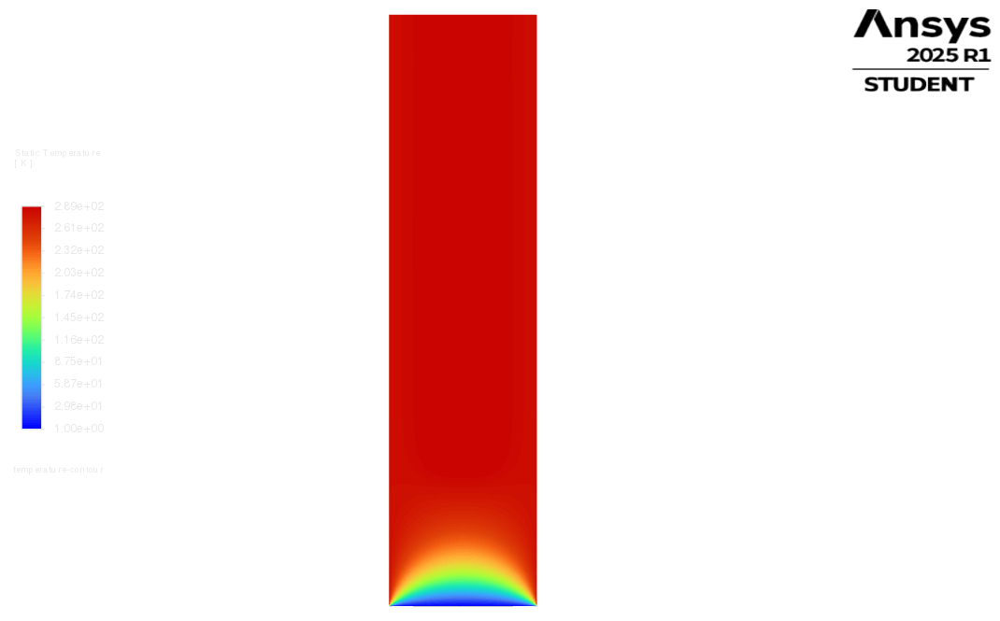
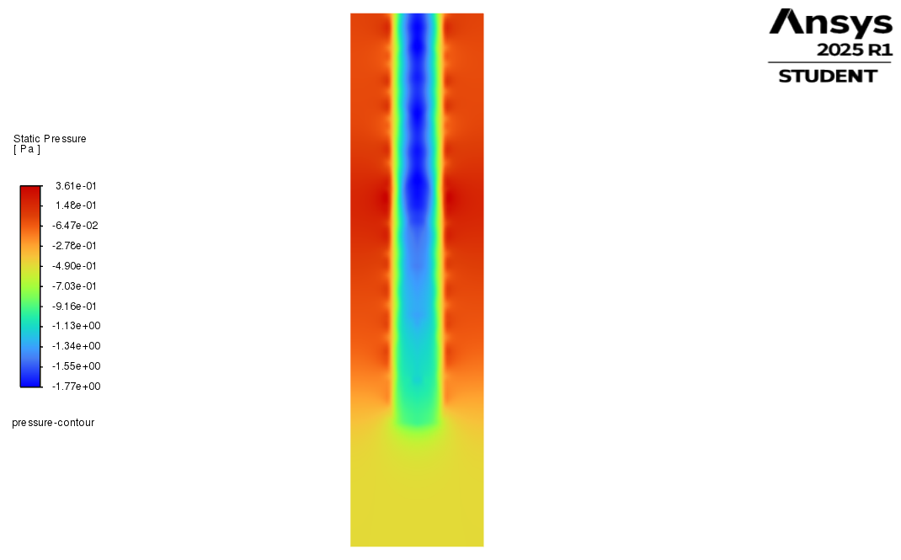
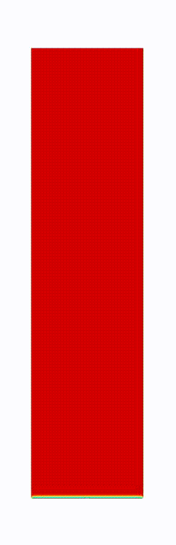

# MHD-Solidification-MacroSegregation-CFD
Multiphysics simulation of MHD-driven directional solidification and macro-segregation in Ga-In alloy using ANSYS Fluent. Extracts thermal gradient (G) and flow velocity (V) for micro-scale Phase-Field coupling (MiCRESS).

# MHD-Driven Solidification and Macro-Segregation Simulation

**Project:** Simulation of flow, directional solidification, and macro-segregation of Ga-In alloy under Rotating Magnetic Field (RMF).  
**Software:** ANSYS Fluent 2025 R1 (Student Version)  
**Context:** Macro-scale multiphysics analysis to provide boundary conditions for Micro-scale dendritic growth simulations (Phase-Field / MiCRESS).

## 📌 Project Overview
This project investigates the impact of Rotating Magnetic Fields (MHD) on the solidification of a binary alloy (**Ga-75wt% In-25wt%**). The simulation couples electromagnetic stirring, heat transfer, phase change, and chemical species transport to analyze the formation of macro-segregation patterns.

The primary objective is to extract critical solidification parameters at the dendritic tip—**Thermal Gradient ($G$)**, **Growth Rate ($R$)**, and **Flow Velocity ($V$)**—to serve as input boundary conditions for micro-structural simulations.

## ⚙️ Methodology & Physics Setup

The simulation was performed in a **2D Axisymmetric** domain representing a cylindrical crucible ($R=12.5$ mm, $H=100$ mm).

### 1. Physics Models
* **Viscous Model:** Laminar Flow.
* **Energy:** Enabled (Heat transfer solved).
* **Solidification & Melting:** Enthalpy-Porosity formulation used with the **Scheil Rule** for micro-segregation modeling.
* **Species Transport:** Enabled for Macro-Segregation analysis.
    * **Solutal Buoyancy:** Enabled (Critical for simulating the settling of heavy solute).
    * **Gravity:** -9.81 m/s² acting in the axial ($X$) direction.
* **MHD Forcing:** Lorentz forces applied via Source Terms (Tangential Momentum) to simulate the RMF.

### 2. Material Properties (Ga-In Alloy)
* **Mixture Density:** Boussinesq Approximation (Ref Density: $6326$ kg/m³).
* **Partition Coefficient ($k$):** $0.8$ (Indium rejection into the liquid phase).
* **Latent Heat:** $70,000$ J/kg.
* **Melting Range:** $T_{solidus} = 288$ K, $T_{liquidus} = 290$ K.
* **Mass Diffusivity:** $2.0 \times 10^{-9}$ m²/s.

### 3. Boundary Conditions
* **Cooling:** Outer wall fixed at **280 K** (below Solidus) to induce directional solidification from the wall towards the center.
* **Initial Condition:** Melt initialized at **300 K** with a uniform **0.25 mass fraction** of Indium.

---

## 📊 Simulation Results (Contours)

### 1. Solidification & Segregation (The Main Results)
The interaction between the MHD-driven flow and the solidification front creates a wavy interface and significant macro-segregation.

| Liquid Fraction (Wavy Interface) | Macro-Segregation (Indium Distribution) |
| :---: | :---: |
|  |  |
| *Mushy zone morphology under RMF* | *Depletion at walls (Blue), Enrichment at center (Red)* |

### 2. Micro-Scale Bridge Parameters (Inputs for MiCRESS)
Critical parameters extracted from the dendritic tip for further phase-field simulations.

| Temperature Gradient ($G$) | Swirl Velocity ($V$) |
| :---: | :---: |
|  |  |
| *High gradient zone at the interface (~12,000 K/m)* | *Flow velocity at the boundary layer (~0.013 m/s)* |

### 3. Physics Fields
General thermal and pressure distribution within the crucible.

| Temperature Field | Pressure Field | Residuals |
| :---: | :---: | :---: |
|  |  |  |

---

## 🎬 Time-Dependent Evolution (Animations)

Dynamic evolution of the solidification process.

| Solidification Front Evolution | Chemical Segregation Evolution |
| :---: | :---: |
|  |  |
| *Progress of the solid shell* | *Indium settling over time* |

| Flow Field Evolution | Thermal Field Evolution |
| :---: | :---: |
|  |  |
| *Development of MHD swirling flow* | *Cooling process* |

---

## 📈 Key Results & Micro-Scale Bridge

The following parameters were extracted from the solidification front ($f_L \approx 0.99$) at $t=20$s to be used in **MiCRESS** (Phase-Field) simulations:

| Parameter | Value | Method of Extraction |
| :--- | :--- | :--- |
| **Temperature Gradient ($G$)** | **~12,000 K/m** | Probed directly at the solid-liquid interface. |
| **Flow Velocity ($V$)** | **~0.013 m/s** | Probed at the hydrodynamic boundary layer near the dendrite tips. |
| **Growth Rate ($R$)** | **~6.0e-4 m/s** | Calculated based on the evolution of shell thickness over time. |
| **Segregation Pattern** | **Confirmed** | Depletion in solid shell ($<25\%$) and enrichment in liquid bulk ($>25\%$) observed. |

---

## 🚀 How to Reproduce
1.  **Load Setup:** Open ANSYS Fluent and load the `2D Axisymmetric` solver.
2.  **Define Materials:** Create `gallium` and `indium` fluids, then define a Mixture using the `boussinesq` density model.
3.  **Initialization:** Use Standard Initialization ($T=300$ K, Indium Mass Fraction=$0.25$).
4.  **Run:** Execute for 40,000 time steps with $\Delta t = 0.0005$ s (Total flow time = 20s).

---
**Author:** Burak Yörükçü
